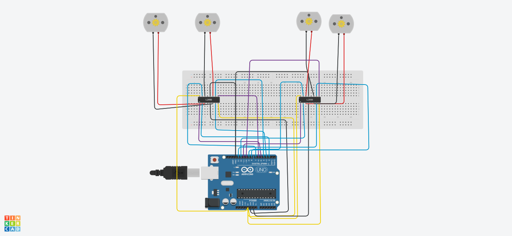

# Incredible Bombul - Multi-Motor Arduino Control (Tinkercad Simulation)

An Arduino-based simulation project designed to control **four DC motors** simultaneously using **two L293D motor driver ICs**. Built and simulated on **Autodesk Tinkercad**, this project executes a precise sequence of automated movements, including forward, backward, and individual motor maneuvering phases.

---

## 📸 Circuit Layout & Schematic

### 🔌 Breadboard Circuit View

### 📐 Electrical Schematic View

---

## 🛠️ Components Used (Tinkercad)

* **1x Arduino Uno** R3
* **2x L293D** Motor Driver ICs
* **4x DC Motors**
* **1x Breadboard** and Jumper Wires
* **Power Supply** (Integrated 5V Rails)

---

## 📌 Pin Configuration (Wiring Table)

| Motor | Enable Pin (EN) | Input 1 (IN) | Input 2 (IN) | Driver IC |
| :--- | :--- | :--- | :--- | :--- |
| **Motor 1** | Pin 5 | Pin 2 | Pin 3 | L293D #1 |
| **Motor 2** | Pin 6 | Pin 4 | Pin 7 | L293D #1 |
| **Motor 3** | Pin 10 | Pin 8 | Pin 9 | L293D #2 |
| **Motor 4** | Pin 11 | Pin 12 | Pin 13 | L293D #2 |

---

## ⚙️ Code Logic & Movement Sequence

The system operates continuously via the `loop()` function in four timed phases:

1. **Phase 1 (Forward Motion):** All 4 motors spin forward for **30 seconds** (`30000 ms`).
2. **Phase 2 (Reverse Motion):** All 4 motors reverse direction for **60 seconds** (`60000 ms`).
3. **Phase 3 (Turn Maneuver A):** Motors 2, 3, and 4 shift directions while Motor 1 stops for **5 seconds** (`5000 ms`).
4. **Phase 4 (Turn Maneuver B):** Alternate motor rotation directions for **5 seconds** (`5000 ms`) before restarting the sequence.

---
